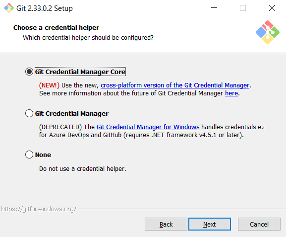
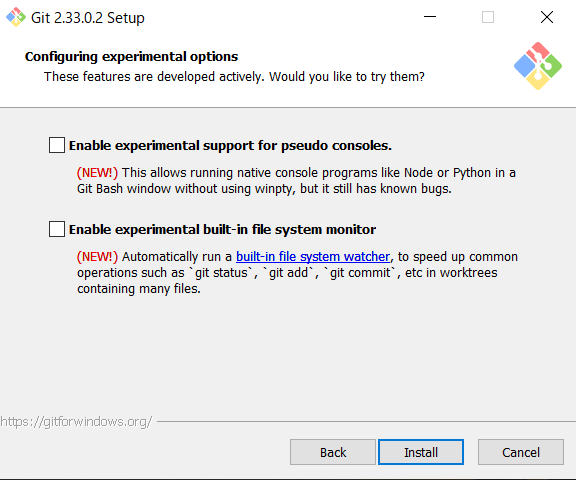
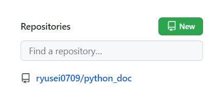
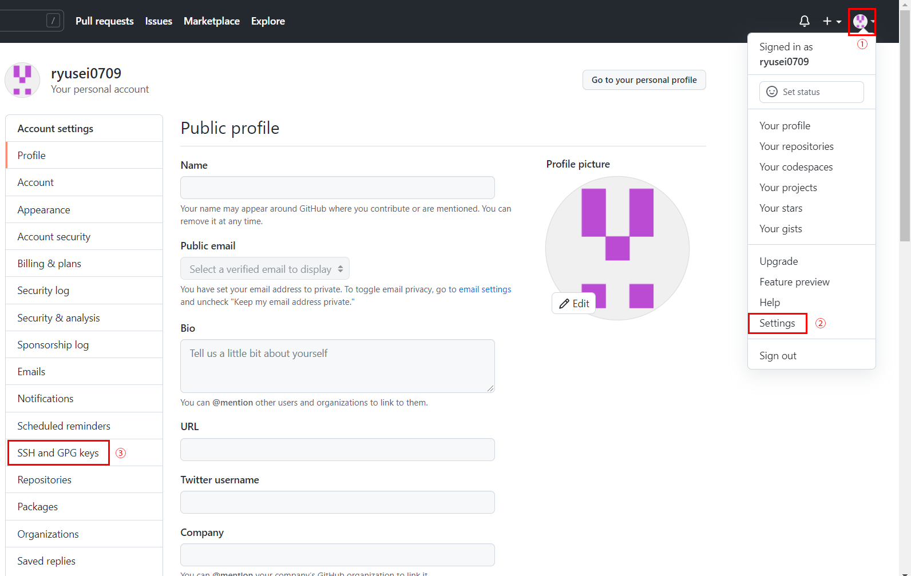
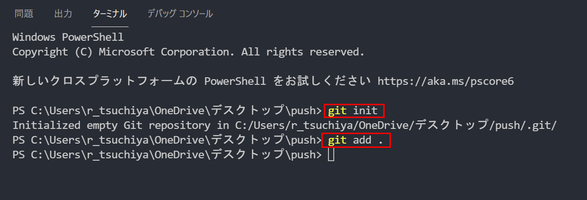

# Git Github環境構築
## 目次

※Githubのアカウントを作成されていない方は下記のURLよりアカウントを作成してください。

https://github.com/join

1. Gitのインストール
2. ユーザー名とメールアドレスの設定
3. Githubのアカウント設定

### 1 Gitのインストール

https://git-for-windows.github.io/

上記のサイトよりGitのインストールを行ってください。

Downloadボタンをクリックし、exeファイルを実行してください。

「Next」をクリックしてください

「Next」をクリックしてください

「Next」をクリックしてください

「Next」をクリックしてください

「use Visual Studio Code as Git´s default editor」 を選択し
「Next」をクリックしてください。

「Next」をクリックしてください。

「Next」をクリックしてください。

「Next」をクリックしてください。

「Next」をクリックしてください。

「Next」をクリックしてください。

「Next」をクリックしてください。

「Next」をクリックしてください。

「Next」をクリックしてください。

「Next」をクリックしてください。

何も選択せず「install」をクリック。

「Finish」をクリック。

## エクスプローラーにディレクトリに「.git」を表示させよう。

「ファイル」をクリック

ユーザー設定->設定をクリックしてください。

設定の検索バーに「Files Exclude」を入力し、「**/.git」を削除してください。

削除が完了しましたら、Visual Studio Code のターミナルを起動(Ctrl + @)してください。

ターミナルを起動し「git init」とコマンドを入力してみましょう。

エクスプローラーに「.git」と表示されたら成功です。

## Git hub のアカウントにログインします。

「New」というボタンをクリックしてください。

リモートリポジトリを作成して行きます。

Repository nameに任意の名前を記述します。

privateにチェックを入れて

「createa repository」をクリックします。

リモートリポジトリが完成出来ました。

## ローカルリポジトリから、リモートリポジトリへプッシュしよう。

Windowsの検索
Git Bashと入力し。「Git Bash」アプリケーションを立ち上げて行きます。

下記のコマンドを実行し、任意のユーザー名とメールアドレスを設定してください。

git config --global user.name "ユーザー名"

git config --global user.email "メールアドレス"

※メールアドレスとユーザー名を設定することで、誰がコミットしたか
分かる様になります。

## リモートリポジトリにpushしよう

「cd」 チェンジディレクトリコマンドを使用し、デスクトップに移動してください。

Ex 「cd desktop」

「mkdir」メイクディレクトリコマンドを使用し、任意のフォルダを作成してください。

Ex 「mkdir push」

デスクトップにフォルダが作成されたら成功です。

## sshKeyを作成しよう

自分のパソコンからGithubにソースコードを転送する際に、「鍵」が必要になります。

今回はその鍵を作成してきます。

「ssh-keygen -t rsa -b 4096」

上記のコマンドを入力しましたらEnterを押しましょう。

>Generating public/private rsa key pair.
>Enter file in which to save the key (/Users/(username)/.ssh/id_rsa):

上記のレスポンスがきましたら、そのまま「Enter」を押してください。

過去にsshkeyを作成した事がある方は「already exists」っとレスポンスが

返ってきますが、ここでは 「y」を入力し「Enter」を押します。

「Enter passphrase」とパスワードの設定を求められるので任意のパスワードを決めて入力しましたら、

「Enter same passphrase again:」パスワードの確認を求めれますので、再度同じパスワードを入力してください。

この様な画面になりましたら。sshKeyの作成が完了です。

## GitBash のsshKeyをクリップボードにコピーしよう。

作成したsshKeyを 「clip < /c/Users/r_tsuchiya/.ssh/id_rsa.pub」コマンドを入力しクリップボードにコピーします。

※Ctrl + c などショートカットは利用できないので注意してください。

## Git hubと自分のPCを結びつけよう。

Git Hub にログインしてください。

アカウントのアイコンをクリックし、「Settings」をクリックした後、「SSH and GPG keys」をクリックしてください。

「New SSH key」をクリックしてください。

タイトルは任意で構いません。

「key」の場所に先ほどBashからコピーした、sshkeyを貼り付けて、「Add SSH key」をクリックしてください。

## 実際にpushしてみよう

vsCodeのターミナルを開き。(Ctrl + @)
作成したフォルダの中に移動出来ているか確認してください。

「git init」コマンドを入力し、「.git」を作成しましょう。

「git add .」コマンドを入力し、すべてのファイルをインデックスに登録します。

「git commit -m "任意のコメント"」コマンドを入力しましょう。

「git remote add origin git@sshアドレス」コマンドを入力しましょう。

※リポジトリのgit@に続くアドレスをコピーします。

コマンド入力できたら。「Enter」を押しましょう。

「git push origin master」コマンドを入力しGitHubへプッシュします。

パスワードの入力が求められるので入力してください。

このようにレスポンスが返ってきたら、push完了です。

GitHubにhtmlファイルが転送されているのが分かります。

